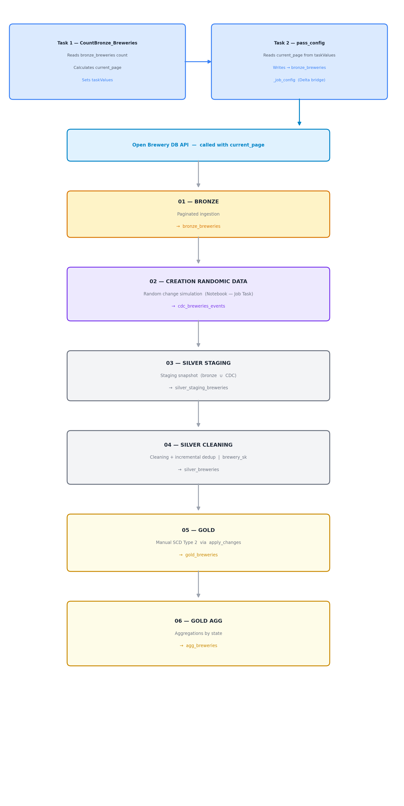

text
# 🍺 Breweries Medallion Architecture — Databricks Pipeline
[](https://www.databricks.com/)
[](https://www.python.org/)
[](https://delta.io/)

## 🎯 Overview
Project implementing a **Medallion Architecture** on Databricks,
with incremental ingestion from the public [Open Brewery DB](https://www.openbrewerydb.org/) API,
CDC simulation, data cleaning, SCD Type 2, and Gold aggregations.

---

## 📐 Overall Architecture


---

## 🗂️ Tables Overview

| Table | Layer | Description |
|---|---|---|
| `bronze_breweries_job_config` | Config | Bridge to pass `current_page` to the DLT pipeline |
| `bronze_breweries` | Bronze | Raw API data, incremental append per page |
| `cdc_breweries_events` | Staging | Records modified by the Randomic Data notebook |
| `silver_staging_breweries` | Silver | Union of bronze + CDC with `ingestion_ts` |
| `silver_breweries` | Silver | Cleaned data with surrogate key `brewery_sk` |
| `gold_breweries` | Gold | SCD Type 2 with `__START_AT` / `__END_AT` |
| `agg_breweries` | Gold | Aggregations by state (active records only) |

---

## 🥉 Bronze Layer — Paginated API Ingestion

Incremental ingestion flow orchestrated via a **Databricks Job**
with three sequential tasks.

### Job Architecture
Task 1: CountBronze_Breweries Task 2: pass_config Task 3: Pipeline_Bronze_Ingestion
────────────────────────────── ────────────────────────── ─────────────────────────────────
Reads count from bronze_breweries Reads current_page Reads current_page from
Calculates current_page → from taskValues → bronze_breweries_job_config
Passes value via taskValues Writes to Delta config Calls API with correct page
Writes to bronze_breweries

text

---

### 📓 Task 1 — `CountBronze_Breweries` (Notebook)

Calculates the current API page based on records already present in `bronze_breweries`
and passes the value to the next task via `dbutils.jobs.taskValues`.

```python
per_page = 10

try:
    total_existing = spark.table("workspace.pipeline_breweries.bronze_breweries").count()
except:
    total_existing = 0

current_page = (total_existing // per_page) + 1

dbutils.jobs.taskValues.set(key="current_page", value=current_page)
```

**Pagination logic:**

| Existing records | `per_page` | `current_page` |
|---|---|---|
| 0 | 10 | 1 |
| 10 | 10 | 2 |
| 50 | 10 | 6 |

---

### 📓 Task 2 — `pass_config` (Notebook)

Reads `current_page` from Task 1 via `taskValues` and persists it in a
**Delta configuration table** accessible by the DLT pipeline.

> This step is required because DLT pipelines cannot read `taskValues` directly —
> the Delta table acts as a bridge.

```python
current_page = dbutils.jobs.taskValues.get(
    taskKey="Compute_Page",
    key="current_page",
    default=1
)

spark.createDataFrame([(current_page,)], ["current_page"]) \
     .write.mode("overwrite") \
     .saveAsTable("workspace.pipeline_breweries.bronze_breweries_job_config")
```

---

### ⚙️ Task 3 — `Pipeline_Bronze_Ingestion` (DLT Pipeline)

Reads `current_page` from the config table, calls the API,
and writes raw data to `bronze_breweries` in **append** mode.

```python
@dp.table(
    name="workspace.pipeline_breweries.bronze_breweries",
    comment="Raw API Ingestion"
)
def bronze_breweries():

    per_page = 10

    current_page = spark.table(
        "workspace.pipeline_breweries.bronze_breweries_job_config"
    ).collect()["current_page"]

    response = requests.get(
        "https://api.openbrewerydb.org/v1/breweries",
        params={"page": current_page, "per_page": per_page}
    )
    data = response.json()

    if data:
        return spark.createDataFrame(data, schema=bronze_schema)
    else:
        return spark.createDataFrame([], schema=bronze_schema)
```

**`bronze_breweries` schema:**

| Column | Type | Notes |
|---|---|---|
| `id` | StringType | Business key |
| `name` | StringType | |
| `brewery_type` | StringType | |
| `address_1` | StringType | |
| `address_2` | StringType | |
| `address_3` | StringType | |
| `city` | StringType | |
| `state_province` | StringType | |
| `postal_code` | StringType | |
| `country` | StringType | |
| `longitude` | DoubleType | Geographic coordinate |
| `latitude` | DoubleType | Geographic coordinate |
| `phone` | StringType | |
| `website_url` | StringType | |
| `state` | StringType | |
| `street` | StringType | |

> **Note:** The schema is explicitly declared to avoid the `CANNOT_DETERMINE_TYPE`
> error that occurs when advanced API pages contain columns with all `null` values.

---

## 🥈 Silver Layer — Staging, CDC & Cleaning

### 📓 Notebook — `Creation Randomic Data` (Job Task)

Simulates realistic brewery changes to test the downstream SCD2 logic.
Modified records are written to `cdc_breweries_events`.

**Logic:**
- Reads records from `bronze_breweries` and adds `ingestion_ts`
- Randomly selects between 3 and 10 distinct breweries per run
- For each, randomly modifies one field: `phone`, `street` or `name`
- Assigns a new `ingestion_ts = datetime.now()` to flag the change
- Appends modified records to `cdc_breweries_events`

**Fake generators:**

| Field | Generated examples |
|---|---|
| `phone` | `+1-500-XXXXXXX`, `+39-081-XXXXXXX` |
| `street` | `42 Oak Ave`, `17 Brewery Ln` |
| `name` | `[FirstWord] Craft Beer`, `[...] Taproom` |

---

### 🔧 `utils.py` — Helper Functions

#### `clean_phone(col_name)`
Cleans phone numbers by removing the international prefix and
non-numeric characters. Returns `"Unknown"` if `null`.
"+1-800 333-5555" → "8003335555"
null → "Unknown"

text

#### `fill_null(col_name, fill_value)`
Replaces `null` values with a specified default value.
null → "Doesn't exist"

text

---

### ⚙️ DLT — `silver_staging_breweries`

Merges real API data with simulated CDC changes,
adding `ingestion_ts` for SCD2 tracking.
api_filtered = bronze LEFT ANTI JOIN cdc (on id)
silver_staging = api_filtered UNION cdc

text

---

### ⚙️ DLT — `silver_breweries`

Applies data quality rules and cleaning transformations on `silver_staging_breweries`
and generates the **surrogate key** `brewery_sk`.

**Applied filters:**
- `country = 'United States'`
- `address_1 IS NOT NULL`

**Transformations:**

| Field | Rule |
|---|---|
| `address_2`, `address_3` | `null` → `"Doesn't exist"` |
| `name` | Removal of `Â` character (encoding artifact) |
| `phone` | Prefix cleanup + digits only |
| `postal_code` | For US: removes ZIP+4 suffix (`12345-6789` → `12345`) |
| `brewery_sk` | `SHA256(id + "_" + ingestion_ts)` — deterministic surrogate key |

---

## 🥇 Gold Layer — SCD Type 2 & Aggregations

### ⚙️ DLT — `gold_breweries` (SCD Type 2)

Implements **Slow Changing Dimension Type 2** via `dp.create_auto_cdc_flow`.

```python
dp.create_auto_cdc_flow(
    target             = "gold_breweries",
    source             = "silver_breweries_stream",
    keys               = ["id"],
    sequence_by        = col("ingestion_ts"),
    stored_as_scd_type = 2,
    except_column_list = ["ingestion_ts"]
)
```

**DLT-generated columns:**

| Column | Description |
|---|---|
| `__START_AT` | Validity start timestamp |
| `__END_AT` | Validity end timestamp (`null` = current active record) |

---

### ⚙️ DLT — `agg_breweries`

Analytical aggregations on **currently active** Gold records.

```python
.where(F.col("__END_AT").isNull())  # active SCD2 records only
.groupBy("state")
.agg(
    F.count("brewery_sk").alias("num_breweries"),
    F.countDistinct("brewery_type").alias("num_types")
)
.orderBy(F.col("num_breweries").desc())
```

| Output column | Description |
|---|---|
| `state` | US state |
| `num_breweries` | Total number of active breweries |
| `num_types` | Number of distinct brewery types |

---
## 🛠️ Tech Stack

- **Databricks** — Delta Live Tables (DLT), Unity Catalog, Job Orchestration
- **PySpark** — DataFrame API, Streaming, `apply_changes` (SCD Type 2)
- **Delta Lake** — Managed tables, append/overwrite/merge modes
- **Python** — `requests`, `random`, `datetime`, `pyspark.sql.types`
- **Open Brewery DB API** — `https://api.openbrewerydb.org/v1/breweries`

---

## 👨‍💻 Author

**Raffaele Marro**  
Data Engineer | Databricks  
[LinkedIn](https://www.linkedin.com/in/raffaele-marro-6b1681282/)