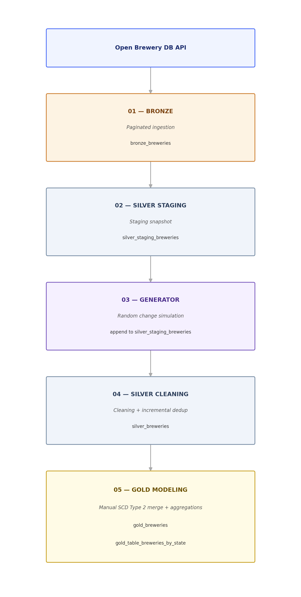

# 🍺 Breweries Medallion Architecture — Databricks Notebooks
[](https://www.databricks.com/)
[](https://www.python.org/)
[](https://delta.io/)

## 🎯 Overview

End-to-end data pipeline on Databricks implementing the **Medallion Architecture** (Bronze → Silver → Gold) using real data from the [Open Brewery DB API](https://www.openbrewerydb.org/), with change simulation and historical tracking via **SCD Type 2**.

---

## 📁 Project Structure
notebooks/

├── 01_BronzeIngestion.ipynb

├── 02_SilverLightStaging.ipynb

├── 03_CreationRandomicData.ipynb

├── 04_SilverCleaning.ipynb

└── 05_GoldModeling.ipynb

---

## 🏗️ Architecture

---

## 📋 Delta Tables — Unity Catalog

| Table | Layer | Description |
|---|---|---|
| `workspace.notebook_breweries.bronze_breweries` | Bronze | Raw API data, incremental append per page |
| `workspace.notebook_breweries.silver_staging_breweries` | Silver | Full snapshot + simulated changes, includes `ingestion_ts` |
| `workspace.notebook_breweries.silver_breweries` | Silver | Cleaned and validated data, US only with non-null `address_1` |
| `workspace.notebook_breweries.gold_breweries` | Gold | SCD Type 2 with `brewery_sk`, `valid_from`, `valid_to`, `current` |
| `workspace.notebook_breweries.gold_table_breweries_by_state` | Gold | Aggregation: active brewery count per US state |

---

## 🔍 Notebook Details

### 01 — Bronze Ingestion

Performs a **paginated** call to the Open Brewery DB API and appends results to the bronze table.

**Pagination logic:**
```python
per_page = 10
total_existing = spark.table("bronze_breweries").count()  # 0 if table doesn't exist
current_page = (total_existing // per_page) + 1
```

- Each run fetches exactly one page of 10 records
- The page number is computed dynamically based on existing record count
- Write mode is **append** — raw data is never overwritten
- Maximum supported records per page by the API is 200

**Output:** `bronze_breweries` — 10 new records appended per run

---

### 02 — Silver Light Staging

Transforms bronze data into a clean snapshot, adding an ingestion timestamp for SCD2 tracking.

**Transformations:**
- Selection of relevant columns (drops unnecessary fields)
- Adds `ingestion_ts = current_timestamp()` — used as `sequence_by` for SCD2
- Write mode: **overwrite** with `overwriteSchema = True`

**Output:** `silver_staging_breweries` — full snapshot refreshed on every run

---

### 03 — Creation Randomic Data

Simulates realistic brewery changes to test the downstream SCD2 logic.

**Logic:**
- Randomly selects between 3 and 10 breweries from the silver staging table
- For each brewery, randomly modifies one of: `phone`, `street`, or `name`
- Assigns a new `ingestion_ts` to signal the change to the SCD2 layer
- Modified records are **appended** to `silver_staging_breweries`

**Fake data generators:**
| Field | Examples |
|---|---|
| `phone` | `+1-500-XXXXXXX`, `+39-081-XXXXXXX` |
| `street` | `42 Oak Ave`, `17 Brewery Ln` |
| `name` | `[FirstWord] Craft Beer`, `[...] Taproom` |

**Output:** N modified rows appended to `silver_staging_breweries`

---

### 04 — Silver Cleaning

Applies data quality rules and incremental deduplication to populate the clean silver table.

**Filters applied:**
- `country = 'United States'`
- `address_1 IS NOT NULL`

**Transformations:**
| Field | Rule |
|---|---|
| `address_2`, `address_3` | Null → `"Doesn't exist"` |
| `name` | Removes `Â` character (encoding artifact) |
| `phone` | Strips international prefix + keeps digits only |
| `postal_code` | For US: removes ZIP+4 suffix (e.g. `12345-6789` → `12345`) |

**Incremental logic:**
```python
# Inserts only records not already present in silver (anti-join on id + ingestion_ts)
new_records = cleaned_df.join(existing_df, on=["id", "ingestion_ts"], how="left_anti")
```

**Output:** `silver_breweries` — only new records appended, no duplicates

---

### 05 — Gold Modeling

Implements **Slow Changing Dimension Type 2** manually via Delta `merge()` and produces analytical aggregations.

#### Gold Schema

| Column | Type | Description |
|---|---|---|
| `brewery_sk` | string | Surrogate key: `SHA256(id + "_" + ingestion_ts)` |
| `id` | string | Business key from the API |
| `name`, `brewery_type`, ... | string | Brewery attributes |
| `valid_from` | timestamp | Record validity start |
| `valid_to` | timestamp | Record validity end (`NULL` if current) |
| `current` | boolean | `True` only for the active version |

#### Manual SCD2 Logic (3 steps)
Step 1 — Source deduplication
silver_dedup = latest version per ID (Window + row_number DESC on ingestion_ts)

Step 2 — Change detection
change_df = join source ⟕ target (current=true) WHERE fields differ (null-safe <=>)

Step 3 — Staged DataFrame + Merge
staged_df = silver_dedup (merge_id = id)
UNION change_df (merge_id = NULL → forces INSERT)

MERGE ON target.id = source.merge_id AND target.current = true
WHEN MATCHED AND changed → UPDATE valid_to = ingestion_ts, current = False
WHEN NOT MATCHED → INSERT new record (valid_from = ingestion_ts, current = True)

text

> **Note:** `brewery_sk` is generated as `SHA256(id + "_" + ingestion_ts)` to guarantee determinism and idempotency across re-runs. Using `uuid()` was intentionally avoided, as it would generate a different surrogate key for the same record on every execution.

#### Aggregations

- **`gold_table_breweries_by_state`** — Count of active breweries (`current = true`) grouped by US state, ordered by count descending
- Final column ordering in `gold_breweries` is enforced with `brewery_sk` as the first column for readability

---

## ⚙️ Setup

### Prerequisites
- Databricks Runtime with Delta Lake
- Unity Catalog enabled
- Catalog: `workspace`, Schema: `notebook_breweries`

### Initial Setup
```sql
-- Create schema if it doesn't exist
CREATE SCHEMA IF NOT EXISTS workspace.notebook_breweries;
```

### Execution Order
01 → 02 → 03 → 04 → 05

> Notebooks **01** and **03** can be run multiple times to simulate new ingestions and field changes. The downstream layers (04, 05) will handle new data incrementally.

---

## 🧪 SCD2 Validation

Validation queries included (under `%skip`) in `02_SilverLightStaging` and `05_GoldModeling`:

```sql
-- Full history for a specific brewery
SELECT id, name, street, valid_from, valid_to, current
FROM gold_breweries
WHERE id = '4dcaeaa3-d7cc-4016-9392-5bde4e3a8f4d'
ORDER BY valid_from;

-- IDs with more than one current=true row (anomaly check)
SELECT id FROM gold_breweries
GROUP BY id
HAVING COUNT_IF(current = true) > 1;

-- Records with valid_to < valid_from (temporal inconsistency)
SELECT * FROM gold_breweries
WHERE valid_to IS NOT NULL AND valid_to < valid_from;
```

---

## 🛠️ Tech Stack

- **Databricks** (Runtime + Unity Catalog)
- **PySpark** / **Delta Lake**
- **Python** (`requests`, `random`, `datetime`)
- **Open Brewery DB API** — `https://api.openbrewerydb.org/v1/breweries`

## 👨‍💻 Author

**Raffaele Marro**  
Data Engineer | Databricks  
[LinkedIn](https://www.linkedin.com/in/raffaele-marro-6b1681282/)
